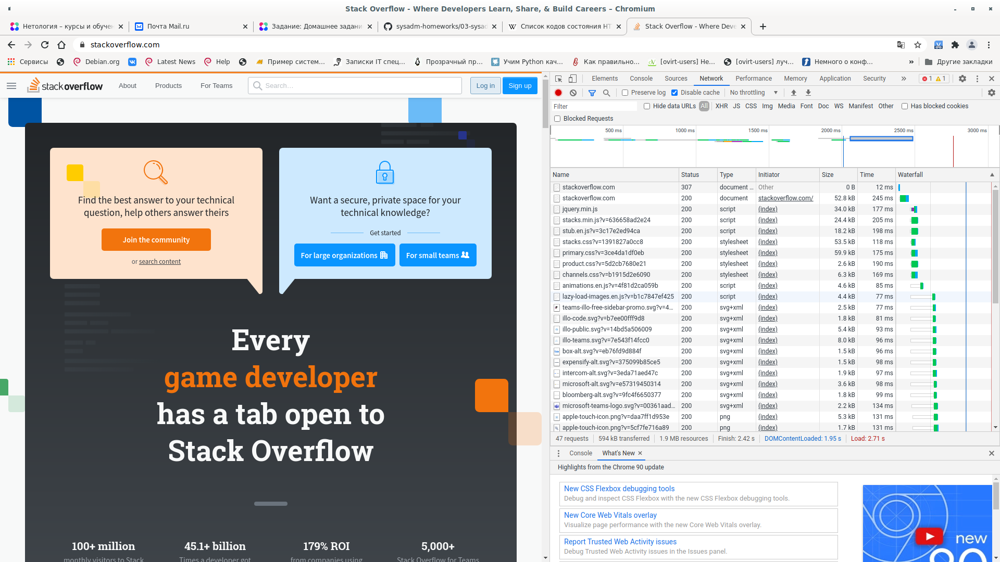
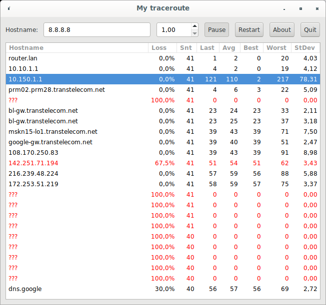

# Домашнее задание к занятию «3.6. Компьютерные сети, лекция 1»

1.
```shell
alexgro@alex-book:~$ telnet stackoverflow.com 80
Trying 151.101.65.69...
Connected to stackoverflow.com.
Escape character is '^]'.
GET /questions HTTP/1.0
HOST: stackoverflow.com

HTTP/1.1 301 Moved Permanently
cache-control: no-cache, no-store, must-revalidate
location: https://stackoverflow.com/questions
x-request-guid: 6388a691-5236-4ace-acc6-d4fc230eaced
feature-policy: microphone 'none'; speaker 'none'
content-security-policy: upgrade-insecure-requests; frame-ancestors 'self' https://stackexchange.com
Accept-Ranges: bytes
Date: Thu, 10 Feb 2022 19:50:09 GMT
Via: 1.1 varnish
Connection: close
X-Served-By: cache-ams21041-AMS
X-Cache: MISS
X-Cache-Hits: 0
X-Timer: S1644522610.892888,VS0,VE75
Vary: Fastly-SSL
X-DNS-Prefetch-Control: off
Set-Cookie: prov=010f9084-36d9-ef19-df1e-9180572d5c74; domain=.stackoverflow.com; expires=Fri, 01-Jan-2055 00:00:00 GMT; path=/; HttpOnly

Connection closed by foreign host.
```
Данный отвер сервера говорит о том, что страница /questions постоянно перемещена в https://stackoverflow.com/questions
2. Консоль разнаботчика:  
При отравке запроса на http://stackoverflow.com, в первом ответе присутствует код 307, который означает перенаправление на адрес https://stackoverflow.com/. 
```
Request URL: http://stackoverflow.com/
Request Method: GET
Status Code: 307 Internal Redirect
Referrer Policy: strict-origin-when-cross-origin
```
Время загрузки страницы 2.71 с.
Смый долгий запрос:  
Request URL: chrome-extension://cjpalhdlnbpafiamejdnhcphjbkeiagm/web_accessible_resources/google-analytics_analytics.js?secret=qu98u5  


3.
```shell
alexgro@alex-book:~$ curl ifconfig.me/ip
91.218.102.73
```
4. 
Провайдер -  Lukjanova Lydia Andreevna PE (KVARTAL-NET) 
Автономная система  -   AS59533 
```shell
alexgro@alex-book:~$ whois 91.218.102.73
% This is the RIPE Database query service.
% The objects are in RPSL format.
%
% The RIPE Database is subject to Terms and Conditions.
% See http://www.ripe.net/db/support/db-terms-conditions.pdf

% Note: this output has been filtered.
%       To receive output for a database update, use the "-B" flag.

% Information related to '91.218.100.0 - 91.218.103.255'

% Abuse contact for '91.218.100.0 - 91.218.103.255' is 'abuse@kvartal.tv'

inetnum:        91.218.100.0 - 91.218.103.255
netname:        LUKYANOVA-NET
country:        RU
org:            ORG-LLAP1-RIPE
admin-c:        DNK21-RIPE
tech-c:         DNK21-RIPE
status:         ASSIGNED PI
mnt-by:         RIPE-NCC-END-MNT
mnt-by:         MNT-LUKYANOVA
mnt-routes:     MNT-LUKYANOVA
mnt-domains:    MNT-LUKYANOVA
created:        2010-07-08T15:23:42Z
last-modified:  2019-03-19T10:33:25Z
source:         RIPE
sponsoring-org: ORG-CS216-RIPE

organisation:   ORG-LLAP1-RIPE
org-name:       Lukjanova Lydia Andreevna PE
org-type:       OTHER
address:        Perm region, Lysva, Fedoseeva 33A
abuse-c:        AR23173-RIPE
mnt-ref:        MNT-LUKYANOVA
mnt-by:         MNT-LUKYANOVA
created:        2010-07-01T14:45:10Z
last-modified:  2014-11-17T16:28:56Z
source:         RIPE # Filtered

person:         Dmitriy N. Kolosnitsyn
address:        Perm region, Lysva, Fedoseeva 33A
phone:          +73424954555
nic-hdl:        DNK21-RIPE
created:        2010-07-01T14:45:07Z
last-modified:  2018-12-19T12:24:03Z
mnt-by:         MNT-LUKYANOVA
source:         RIPE # Filtered

% Information related to '91.218.102.0/24AS59533'

route:          91.218.102.0/24
descr:          KVARTAL-NET, Lysva, Russia
descr:          KVARTAL Lysva PPPoE Clients
origin:         AS59533
mnt-by:         MNT-LUKYANOVA
created:        2012-08-04T11:31:16Z
last-modified:  2012-08-04T11:31:16Z
source:         RIPE

% This query was served by the RIPE Database Query Service version 1.102.2 (ANGUS)


```
5.
```shell
alexgro@alex-book:~$ traceroute -nA 8.8.8.8
traceroute to 8.8.8.8 (8.8.8.8), 30 hops max, 60 byte packets
 1  192.168.88.1 [*]  6.580 ms  6.520 ms  6.491 ms
 2  10.10.1.1 [*]  6.465 ms  6.437 ms  6.411 ms
 3  10.150.1.1 [*]  203.728 ms  203.755 ms  203.702 ms
 4  188.43.19.230 [AS20485]  6.245 ms  6.160 ms  6.092 ms
 5  * * *
 6  188.43.239.122 [AS20485]  31.679 ms 188.43.239.130 [AS20485]  28.906 ms  28.852 ms
 7  188.43.239.9 [AS20485]  29.750 ms  29.744 ms  29.736 ms
 8  217.150.55.234 [AS20485]  41.327 ms  41.278 ms  48.009 ms
 9  188.43.10.141 [AS20485]  43.351 ms  39.388 ms  44.820 ms
10  108.170.250.130 [AS15169]  45.248 ms 108.170.250.34 [AS15169]  44.734 ms 108.170.250.113 [AS15169]  44.726 ms
11  * 172.253.66.116 [AS15169]  60.607 ms  72.708 ms
12  108.170.232.251 [AS15169]  72.544 ms 172.253.65.159 [AS15169]  56.377 ms 172.253.65.82 [AS15169]  72.497 ms
13  216.239.42.23 [AS15169]  55.561 ms 142.250.210.45 [AS15169]  55.549 ms 172.253.51.249 [AS15169]  53.773 ms
14  * * *
15  * * *
16  * * *
17  * * *
18  * * *
19  * * *
20  * 8.8.8.8 [AS15169]  56.698 ms *

```
6.


7.
```shell
alexgro@alex-book:~$ dig dns.google

; <<>> DiG 9.16.15-Debian <<>> dns.google
;; global options: +cmd
;; Got answer:
;; ->>HEADER<<- opcode: QUERY, status: NOERROR, id: 2397
;; flags: qr rd ra; QUERY: 1, ANSWER: 2, AUTHORITY: 4, ADDITIONAL: 4

;; QUESTION SECTION:
;dns.google.			IN	A

;; ANSWER SECTION:
dns.google.		145	IN	A	8.8.4.4
dns.google.		145	IN	A	8.8.8.8

;; AUTHORITY SECTION:
dns.google.		6431	IN	NS	ns4.zdns.google.
dns.google.		6431	IN	NS	ns1.zdns.google.
dns.google.		6431	IN	NS	ns2.zdns.google.
dns.google.		6431	IN	NS	ns3.zdns.google.

;; ADDITIONAL SECTION:
ns4.zdns.google.	126733	IN	A	216.239.38.114
ns1.zdns.google.	126733	IN	A	216.239.32.114
ns2.zdns.google.	126733	IN	A	216.239.34.114
ns3.zdns.google.	126733	IN	A	216.239.36.114

;; Query time: 8 msec
;; SERVER: 192.168.88.1#53(192.168.88.1)
;; WHEN: Пт фев 11 00:44:09 +05 2022
;; MSG SIZE  rcvd: 201

```

8.
```shell
alexgro@alex-book:~$ dig -x 8.8.4.4

; <<>> DiG 9.16.15-Debian <<>> -x 8.8.4.4
;; global options: +cmd
;; Got answer:
;; ->>HEADER<<- opcode: QUERY, status: NOERROR, id: 25486
;; flags: qr rd ra; QUERY: 1, ANSWER: 1, AUTHORITY: 2, ADDITIONAL: 2

;; QUESTION SECTION:
;4.4.8.8.in-addr.arpa.		IN	PTR

;; ANSWER SECTION:
4.4.8.8.in-addr.arpa.	25810	IN	PTR	dns.google.

;; AUTHORITY SECTION:
8.8.in-addr.arpa.	19817	IN	NS	ns2.level3.net.
8.8.in-addr.arpa.	19817	IN	NS	ns1.level3.net.

;; ADDITIONAL SECTION:
ns2.level3.net.		835	IN	A	209.244.0.2
ns1.level3.net.		835	IN	A	209.244.0.1

;; Query time: 8 msec
;; SERVER: 192.168.88.1#53(192.168.88.1)
;; WHEN: Пт фев 11 00:47:09 +05 2022
;; MSG SIZE  rcvd: 140

alexgro@alex-book:~$ dig -x 8.8.8.8

; <<>> DiG 9.16.15-Debian <<>> -x 8.8.8.8
;; global options: +cmd
;; Got answer:
;; ->>HEADER<<- opcode: QUERY, status: NOERROR, id: 12992
;; flags: qr rd ra; QUERY: 1, ANSWER: 1, AUTHORITY: 2, ADDITIONAL: 2

;; QUESTION SECTION:
;8.8.8.8.in-addr.arpa.		IN	PTR

;; ANSWER SECTION:
8.8.8.8.in-addr.arpa.	15527	IN	PTR	dns.google.

;; AUTHORITY SECTION:
8.8.in-addr.arpa.	19790	IN	NS	ns1.level3.net.
8.8.in-addr.arpa.	19790	IN	NS	ns2.level3.net.

;; ADDITIONAL SECTION:
ns1.level3.net.		808	IN	A	209.244.0.1
ns2.level3.net.		808	IN	A	209.244.0.2

;; Query time: 4 msec
;; SERVER: 192.168.88.1#53(192.168.88.1)
;; WHEN: Пт фев 11 00:47:35 +05 2022
;; MSG SIZE  rcvd: 140

```