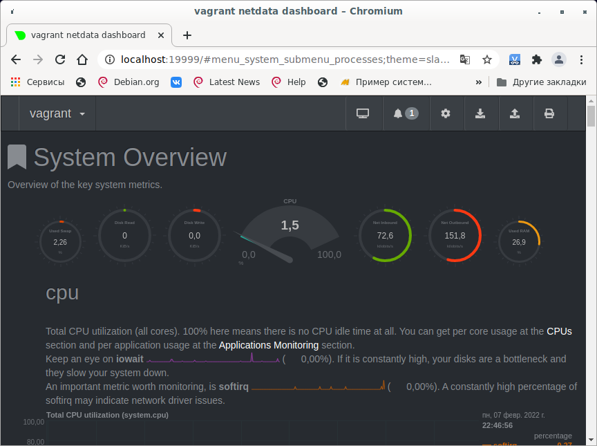

# Домашнее задание к занятию «3.4. Операционный системы, лекция 2»
1. Создан сервис node_exporter, включён в автозагрузку.
```shell
vagrant@vagrant:~$ cat /etc/systemd/system/node_exporter.service
[Unit]
Description=Node_Exporter service

[Service]
EnvironmentFile=-/etc/default/node_exporter
ExecStart=/opt/node_exporter/node_exporter $NE_OPTS

[Install]
WantedBy=multi-user.target
```
```shell
root@vagrant:/etc/systemd/user# systemctl daemon-reload
root@vagrant:/etc/systemd/user# systemctl enable node_exporter.service
Created symlink /etc/systemd/system/multi-user.target.wants/node_exporter.service → /etc/systemd/system/node_exporter.service.
root@vagrant:~# systemctl start node_exporter
root@vagrant:~# systemctl status node_exporter
● node_exporter.service - Node_Exporter service
     Loaded: loaded (/etc/systemd/system/node_exporter.service; enabled; vendor preset: enabled)
     Active: active (running) since Sun 2022-02-06 17:51:10 UTC; 6s ago
   Main PID: 1749 (node_exporter)
      Tasks: 4 (limit: 1071)
     Memory: 2.4M
     CGroup: /system.slice/node_exporter.service
             └─1749 /opt/node_exporter/node_exporter

Feb 06 17:51:10 vagrant node_exporter[1749]: ts=2022-02-06T17:51:10.700Z caller=node_exporter.go:115 level=info collector=thermal_zone
Feb 06 17:51:10 vagrant node_exporter[1749]: ts=2022-02-06T17:51:10.700Z caller=node_exporter.go:115 level=info collector=time
Feb 06 17:51:10 vagrant node_exporter[1749]: ts=2022-02-06T17:51:10.700Z caller=node_exporter.go:115 level=info collector=timex
Feb 06 17:51:10 vagrant node_exporter[1749]: ts=2022-02-06T17:51:10.701Z caller=node_exporter.go:115 level=info collector=udp_queues
Feb 06 17:51:10 vagrant node_exporter[1749]: ts=2022-02-06T17:51:10.701Z caller=node_exporter.go:115 level=info collector=uname
Feb 06 17:51:10 vagrant node_exporter[1749]: ts=2022-02-06T17:51:10.702Z caller=node_exporter.go:115 level=info collector=vmstat
Feb 06 17:51:10 vagrant node_exporter[1749]: ts=2022-02-06T17:51:10.702Z caller=node_exporter.go:115 level=info collector=xfs
Feb 06 17:51:10 vagrant node_exporter[1749]: ts=2022-02-06T17:51:10.703Z caller=node_exporter.go:115 level=info collector=zfs
Feb 06 17:51:10 vagrant node_exporter[1749]: ts=2022-02-06T17:51:10.703Z caller=node_exporter.go:199 level=info msg="Listening on" address=:9100
Feb 06 17:51:10 vagrant node_exporter[1749]: ts=2022-02-06T17:51:10.704Z caller=tls_config.go:195 level=info msg="TLS is disabled." http2=false
root@vagrant:~# systemctl stop node_exporter
root@vagrant:~# systemctl status node_exporter
● node_exporter.service - Node_Exporter service
     Loaded: loaded (/etc/systemd/system/node_exporter.service; enabled; vendor preset: enabled)
     Active: inactive (dead) since Sun 2022-02-06 17:51:34 UTC; 6s ago
    Process: 1749 ExecStart=/opt/node_exporter/node_exporter $NE_OPTS (code=killed, signal=TERM)
   Main PID: 1749 (code=killed, signal=TERM)

Feb 06 17:51:10 vagrant node_exporter[1749]: ts=2022-02-06T17:51:10.701Z caller=node_exporter.go:115 level=info collector=udp_queues
Feb 06 17:51:10 vagrant node_exporter[1749]: ts=2022-02-06T17:51:10.701Z caller=node_exporter.go:115 level=info collector=uname
Feb 06 17:51:10 vagrant node_exporter[1749]: ts=2022-02-06T17:51:10.702Z caller=node_exporter.go:115 level=info collector=vmstat
Feb 06 17:51:10 vagrant node_exporter[1749]: ts=2022-02-06T17:51:10.702Z caller=node_exporter.go:115 level=info collector=xfs
Feb 06 17:51:10 vagrant node_exporter[1749]: ts=2022-02-06T17:51:10.703Z caller=node_exporter.go:115 level=info collector=zfs
Feb 06 17:51:10 vagrant node_exporter[1749]: ts=2022-02-06T17:51:10.703Z caller=node_exporter.go:199 level=info msg="Listening on" address=:9100
Feb 06 17:51:10 vagrant node_exporter[1749]: ts=2022-02-06T17:51:10.704Z caller=tls_config.go:195 level=info msg="TLS is disabled." http2=false
Feb 06 17:51:34 vagrant systemd[1]: Stopping Node_Exporter service...
Feb 06 17:51:34 vagrant systemd[1]: node_exporter.service: Succeeded.
Feb 06 17:51:34 vagrant systemd[1]: Stopped Node_Exporter service.
```
2. Для базового мониторинга можно выбрать следующие опции:
NE_OPTS="--collector.disable-defaults --collector.loadavg --collector.cpu --collector.diskstats --collector.filesystem --collector.meminfo --collector.netdev"

3. Пакет Netdata успешно установлен.


4. По выводу dmesg видно, что система загружена в виртуальной среде:
```shell
vagrant@vagrant:~$ dmesg 
[    0.000000] Linux version 5.4.0-91-generic (buildd@lcy01-amd64-017) (gcc version 9.3.0 (Ubuntu 9.3.0-17ubuntu1~20.04)) #102-Ubuntu SMP Fri Nov 5 16:31:28 UTC 2021 (Ubuntu 5.4.0-91.102-generic 5.4.151)
[    0.000000] Command line: BOOT_IMAGE=/vmlinuz-5.4.0-91-generic root=/dev/mapper/ubuntu--vg-ubuntu--lv ro net.ifnames=0 biosdevname=0
...
[    0.000000] DMI: innotek GmbH VirtualBox/VirtualBox, BIOS VirtualBox 12/01/2006
[    0.000000] Hypervisor detected: KVM
...
[    0.108265] Booting paravirtualized kernel on KVM
...
```
5. Параметр fs.nr_open обозначает максимальное количество файловых дескрипторов, которые может создать процесс.
```shell
vagrant@vagrant:~$ sudo sysctl -a | grep fs.nr_open
fs.nr_open = 1048576
```
```shell
vagrant@vagrant:~$ ulimit -n
1024
```
ulimit -n  - Максимальное количество открытых файловых дескрипторов.

6. 
```shell
root@vagrant:~# unshare -f --pid --mount-proc sleep 1h
root@vagrant:~# ps -aux | grep sleep
root        2018  0.0  0.0   5476   592 pts/0    S    19:41   0:00 sleep 1h
root        2076  0.0  0.0   6432   736 pts/0    S+   19:49   0:00 grep --color=auto sleep
root@vagrant:~# nsenter -t 2018 --pid --mount ps -aux
USER         PID %CPU %MEM    VSZ   RSS TTY      STAT START   TIME COMMAND
root           1  0.0  0.0   5476   592 pts/0    S+   19:41   0:00 sleep 1h
root           4  0.0  0.3   9084  3608 pts/0    R+   19:50   0:00 ps -aux
root@vagrant:~# 
```
7. :(){ :|:& };: - fork бомба. Данная команда генерирует процессы до тех пор, пока не закончится память.
Задушить систему огромным количеством процессов не дал механизм cgroup, который по умолчанию ограничивает количество процессов в сессии на уровне 33 процентов от максимального кол-ва процессов всей системы.  
Настройки данного параметра хранятся в файле /usr/lib/systemd/system/user-.slice.d/10-defaults.conf
```shell
root@vagrant:~# cat /usr/lib/systemd/system/user-.slice.d/10-defaults.conf
#  SPDX-License-Identifier: LGPL-2.1+
#
#  This file is part of systemd.
#
#  systemd is free software; you can redistribute it and/or modify it
#  under the terms of the GNU Lesser General Public License as published by
#  the Free Software Foundation; either version 2.1 of the License, or
#  (at your option) any later version.

[Unit]
Description=User Slice of UID %j
Documentation=man:user@.service(5)
After=systemd-user-sessions.service
StopWhenUnneeded=yes

[Slice]
TasksMax=33%

```
Изменить максимальное количество запускаемых процессов можно параметром TasksMax.
