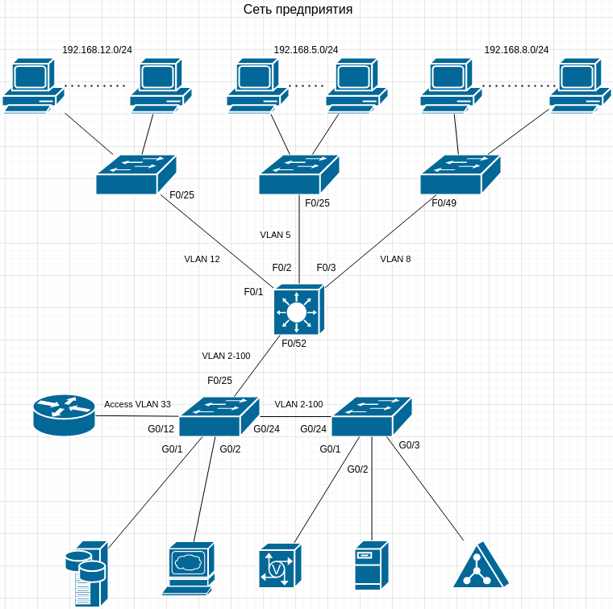

# Домашнее задание к занятию «3.8. Компьютерные сети, лекция 3»

1. 
```shell
route-views>show ip route 91.218.102.73
Routing entry for 91.218.102.0/24
  Known via "bgp 6447", distance 20, metric 0
  Tag 6939, type external
  Last update from 64.71.137.241 2w4d ago
  Routing Descriptor Blocks:
  * 64.71.137.241, from 64.71.137.241, 2w4d ago
      Route metric is 0, traffic share count is 1
      AS Hops 3
      Route tag 6939
      MPLS label: none
```
```shell
route-views>show bgp 91.218.102.73      
BGP routing table entry for 91.218.102.0/24, version 299240947
Paths: (22 available, best #22, table default)
  Not advertised to any peer
  Refresh Epoch 1
  101 3491 20485 20485 59533
    209.124.176.223 from 209.124.176.223 (209.124.176.223)
      Origin IGP, localpref 100, valid, external
      Community: 101:20300 101:22100 3491:300 3491:311 3491:9001 3491:9080 3491:9081 3491:9087 3491:62210 3491:62220 20485:10059
      path 7FE12BD6D618 RPKI State not found
      rx pathid: 0, tx pathid: 0
  Refresh Epoch 1
  3333 31133 59533
    193.0.0.56 from 193.0.0.56 (193.0.0.56)
      Origin IGP, localpref 100, valid, external
      path 7FE00B38C8E8 RPKI State not found
      rx pathid: 0, tx pathid: 0
  Refresh Epoch 1
  8283 31133 59533
    94.142.247.3 from 94.142.247.3 (94.142.247.3)
      Origin IGP, metric 0, localpref 100, valid, external
      Community: 8283:1 8283:101
      unknown transitive attribute: flag 0xE0 type 0x20 length 0x18
        value 0000 205B 0000 0000 0000 0001 0000 205B
              0000 0005 0000 0001 
      path 7FE0A3311DE8 RPKI State not found
      rx pathid: 0, tx pathid: 0
  Refresh Epoch 1
  1351 6939 20485 59533
    132.198.255.253 from 132.198.255.253 (132.198.255.253)
      Origin IGP, localpref 100, valid, external
      path 7FE1152127E0 RPKI State not found
      rx pathid: 0, tx pathid: 0
  Refresh Epoch 1
  57866 3356 20485 59533
    37.139.139.17 from 37.139.139.17 (37.139.139.17)
      Origin IGP, metric 0, localpref 100, valid, external
      Community: 3356:2 3356:22 3356:100 3356:123 3356:501 3356:903 3356:2065 20485:10059
      path 7FE0B16A8DA0 RPKI State not found
      rx pathid: 0, tx pathid: 0
  Refresh Epoch 1
  852 31133 59533
    154.11.12.212 from 154.11.12.212 (96.1.209.43)
      Origin IGP, metric 0, localpref 100, valid, external
      path 7FE0458997C8 RPKI State not found
      rx pathid: 0, tx pathid: 0
  Refresh Epoch 1
  20130 6939 20485 59533
    140.192.8.16 from 140.192.8.16 (140.192.8.16)
      Origin IGP, localpref 100, valid, external
      path 7FE046F21910 RPKI State not found
      rx pathid: 0, tx pathid: 0
  Refresh Epoch 1
  701 5511 12389 59533 59533 59533
    137.39.3.55 from 137.39.3.55 (137.39.3.55)
      Origin IGP, localpref 100, valid, external
      path 7FE0EEDCD300 RPKI State not found
      rx pathid: 0, tx pathid: 0
  Refresh Epoch 1
  53767 174 31133 59533
    162.251.163.2 from 162.251.163.2 (162.251.162.3)
      Origin IGP, localpref 100, valid, external
      Community: 174:21101 174:22005 53767:5000
      path 7FE045CE2C60 RPKI State not found
      rx pathid: 0, tx pathid: 0
  Refresh Epoch 1
  3549 3356 20485 59533
    208.51.134.254 from 208.51.134.254 (67.16.168.191)
      Origin IGP, metric 0, localpref 100, valid, external
      Community: 3356:2 3356:22 3356:100 3356:123 3356:501 3356:903 3356:2065 3549:2581 3549:30840 20485:10059
      path 7FE1027DC348 RPKI State not found
      rx pathid: 0, tx pathid: 0
  Refresh Epoch 1
  3356 20485 59533
    4.68.4.46 from 4.68.4.46 (4.69.184.201)
      Origin IGP, metric 0, localpref 100, valid, external
      Community: 3356:2 3356:22 3356:100 3356:123 3356:501 3356:903 3356:2065 20485:10059
      path 7FE15DEF6B10 RPKI State not found
      rx pathid: 0, tx pathid: 0
  Refresh Epoch 1
  4901 6079 31133 59533
    162.250.137.254 from 162.250.137.254 (162.250.137.254)
      Origin IGP, localpref 100, valid, external
      Community: 65000:10100 65000:10300 65000:10400
      path 7FE0DFDC34D8 RPKI State not found
      rx pathid: 0, tx pathid: 0
  Refresh Epoch 1
  7660 2516 6762 20485 59533
    203.181.248.168 from 203.181.248.168 (203.181.248.168)
      Origin IGP, localpref 100, valid, external
      Community: 2516:1030 7660:9003
      path 7FE02D5FD6A8 RPKI State not found
      rx pathid: 0, tx pathid: 0
  Refresh Epoch 1
  20912 3257 3356 20485 59533
    212.66.96.126 from 212.66.96.126 (212.66.96.126)
      Origin IGP, localpref 100, valid, external
      Community: 3257:8070 3257:30515 3257:50001 3257:53900 3257:53902 20912:65004
      path 7FE0DDB6E368 RPKI State not found
      rx pathid: 0, tx pathid: 0
  Refresh Epoch 1
  3303 20485 59533
    217.192.89.50 from 217.192.89.50 (138.187.128.158)
      Origin IGP, localpref 100, valid, external
      Community: 3303:1004 3303:1006 3303:1030 3303:1031 3303:3056 20485:10059 65101:1082 65102:1000 65103:276 65104:150
      path 7FE15FB86260 RPKI State not found
      rx pathid: 0, tx pathid: 0
  Refresh Epoch 1
  7018 3356 20485 59533
    12.0.1.63 from 12.0.1.63 (12.0.1.63)
      Origin IGP, localpref 100, valid, external
      Community: 7018:5000 7018:37232
      path 7FE0DFEF9D80 RPKI State not found
      rx pathid: 0, tx pathid: 0
  Refresh Epoch 1
  3561 3910 3356 20485 59533
    206.24.210.80 from 206.24.210.80 (206.24.210.80)
      Origin IGP, localpref 100, valid, external
      path 7FE0DCDCEEB8 RPKI State not found
      rx pathid: 0, tx pathid: 0
  Refresh Epoch 2
  2497 20485 59533
    202.232.0.2 from 202.232.0.2 (58.138.96.254)
      Origin IGP, localpref 100, valid, external
      path 7FE0F709BA70 RPKI State not found
      rx pathid: 0, tx pathid: 0
  Refresh Epoch 1
  49788 12552 31133 59533
    91.218.184.60 from 91.218.184.60 (91.218.184.60)
      Origin IGP, localpref 100, valid, external
      Community: 12552:12000 12552:12100 12552:12101 12552:22000
      Extended Community: 0x43:100:1
      path 7FE0413E50A8 RPKI State not found
      rx pathid: 0, tx pathid: 0
  Refresh Epoch 1
  1221 4637 31133 59533
    203.62.252.83 from 203.62.252.83 (203.62.252.83)
      Origin IGP, localpref 100, valid, external
      path 7FE0AE4BA1C8 RPKI State not found
      rx pathid: 0, tx pathid: 0
  Refresh Epoch 1
  3257 1299 31133 59533
    89.149.178.10 from 89.149.178.10 (213.200.83.26)
      Origin IGP, metric 10, localpref 100, valid, external
      Community: 3257:8794 3257:30052 3257:50001 3257:54900 3257:54901
      path 7FE139A84FF8 RPKI State not found
      rx pathid: 0, tx pathid: 0
  Refresh Epoch 1
  6939 20485 59533
    64.71.137.241 from 64.71.137.241 (216.218.252.164)
      Origin IGP, localpref 100, valid, external, best
      path 7FE08D6B82E0 RPKI State not found
      rx pathid: 0, tx pathid: 0x0

```
2. 
```shell
root@vagrant:~# ip link
1: lo: <LOOPBACK,UP,LOWER_UP> mtu 65536 qdisc noqueue state UNKNOWN mode DEFAULT group default qlen 1000
    link/loopback 00:00:00:00:00:00 brd 00:00:00:00:00:00
2: eth0: <BROADCAST,MULTICAST,UP,LOWER_UP> mtu 1500 qdisc fq_codel state UP mode DEFAULT group default qlen 1000
    link/ether 08:00:27:b1:28:5d brd ff:ff:ff:ff:ff:ff
5: dummy0: <BROADCAST,NOARP> mtu 1500 qdisc noop state DOWN mode DEFAULT group default qlen 1000
    link/ether 06:06:be:d5:cc:ac brd ff:ff:ff:ff:ff:ff
6: dummy1: <BROADCAST,NOARP> mtu 1500 qdisc noop state DOWN mode DEFAULT group default qlen 1000
    link/ether b2:00:84:55:53:a8 brd ff:ff:ff:ff:ff:ff
```
```shell
root@vagrant:~# ip addr add 10.0.3.5/24 dev dummy1
root@vagrant:~# ip link set dummy1 up
root@vagrant:~# ping 10.0.3.5
PING 10.0.3.5 (10.0.3.5) 56(84) bytes of data.
64 bytes from 10.0.3.5: icmp_seq=1 ttl=64 time=0.042 ms
64 bytes from 10.0.3.5: icmp_seq=2 ttl=64 time=0.067 ms
64 bytes from 10.0.3.5: icmp_seq=3 ttl=64 time=0.063 ms
64 bytes from 10.0.3.5: icmp_seq=4 ttl=64 time=0.071 ms
```
```shell
root@vagrant:~# ip route add 192.168.9.5/32 via 10.0.2.15
root@vagrant:~# ip route add 192.168.10.0/24 via 10.0.2.16
root@vagrant:~# ip route show
default via 10.0.2.2 dev eth0 proto dhcp src 10.0.2.15 metric 100 
10.0.2.0/24 dev eth0 proto kernel scope link src 10.0.2.15 
10.0.2.2 dev eth0 proto dhcp scope link src 10.0.2.15 metric 100 
10.0.3.0/24 dev dummy1 proto kernel scope link src 10.0.3.5 
192.168.9.5 via 10.0.2.15 dev eth0 
192.168.10.0/24 via 10.0.2.16 dev eth0 
```

3. TCP
```shell
root@vagrant:~# ss -ntpa
State              Recv-Q             Send-Q                          Local Address:Port                           Peer Address:Port              Process                                                          
LISTEN             0                  4096                            127.0.0.53%lo:53                                  0.0.0.0:*                  users:(("systemd-resolve",pid=592,fd=13))                       
LISTEN             0                  128                                   0.0.0.0:22                                  0.0.0.0:*                  users:(("sshd",pid=679,fd=3))                                   
ESTAB              0                  0                                   10.0.2.15:22                                 10.0.2.2:40742              users:(("sshd",pid=957,fd=4),("sshd",pid=920,fd=4))             
LISTEN             0                  128                                      [::]:22                                     [::]:*                  users:(("sshd",pid=679,fd=4))                                   
root@vagrant:~# 
```
Из вывода команды ss видно, что открыто 2 порта: 53 и 22. Установлено одно соединение через порт 22. Порт 53 прослушивает процесс systemd-resolve, порт 22 прослушивает процесс sshd.  

4. UDP
```shell
root@vagrant:~# ss -nupa
State               Recv-Q               Send-Q                              Local Address:Port                             Peer Address:Port              Process                                                 
UNCONN              0                    0                                   127.0.0.53%lo:53                                    0.0.0.0:*                  users:(("systemd-resolve",pid=592,fd=12))              
UNCONN              0                    0                                  10.0.2.15%eth0:68                                    0.0.0.0:*                  users:(("systemd-network",pid=590,fd=19))              
root@vagrant:~# 
```
Из вывода видно тот же 53 порт на интерфейсе lo. Слушается процессом systemd-resolve. Порт 68 слушается процессом dhcp клиента systemd-network.

5. 
   