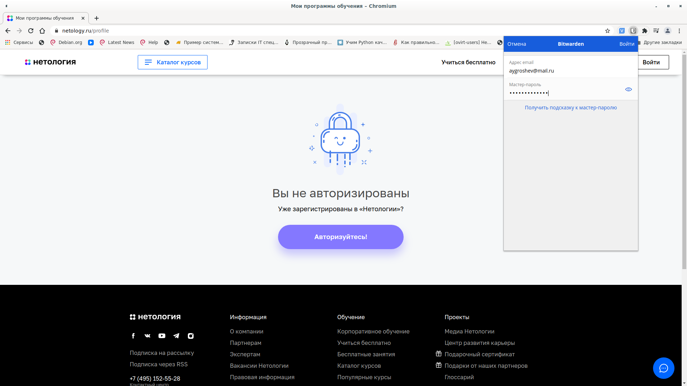
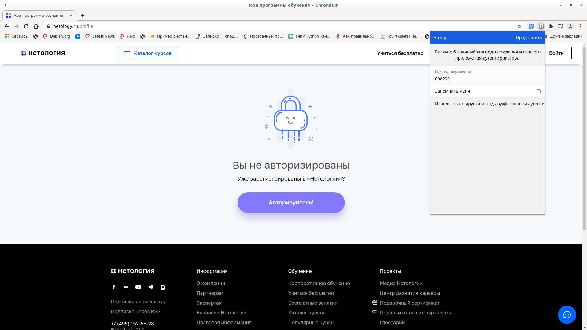
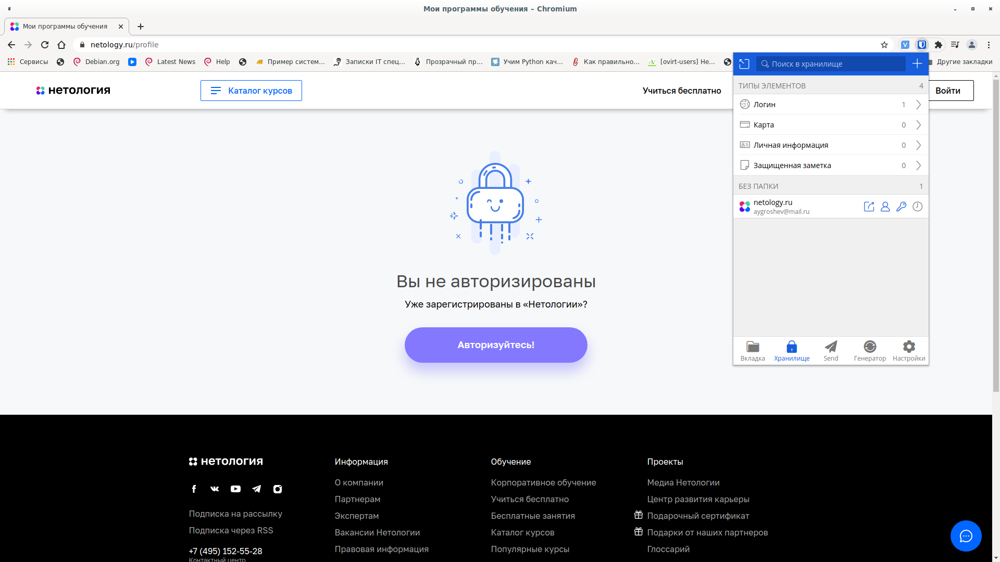
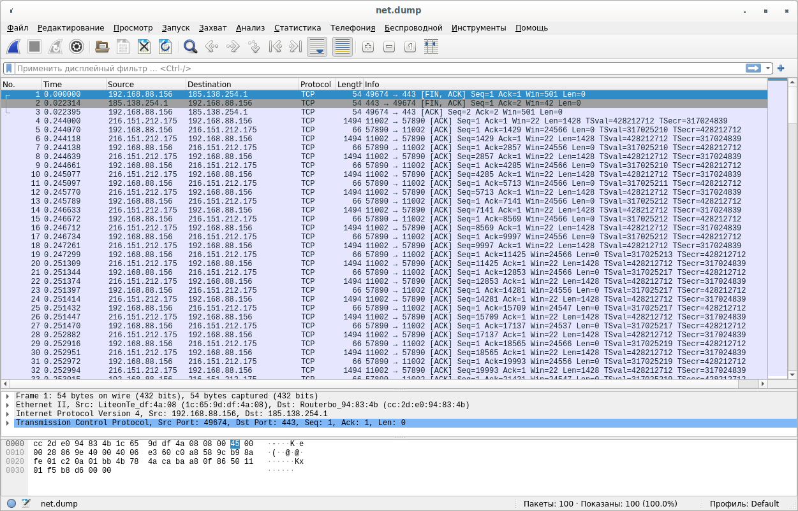

# Домашнее задание к занятию «3.9. Элементы безопасности информационных систем»

1,2. Bitwarden установлен в браузер Chromium, успешно настроена двухфакторная ауткнтификация.





3. vag
Устанавливаем apache2 и генерируем сертификат
```shell
vagrant@vagrant:~$ sudo apt-get install apache2
vagrant@vagrant:~$ openssl genpkey -algorithm RSA -out private.key
vagrant@vagrant:~/ssl$ openssl req -key private.key -new -out req.csr
You are about to be asked to enter information that will be incorporated
into your certificate request.
What you are about to enter is what is called a Distinguished Name or a DN.
There are quite a few fields but you can leave some blank
For some fields there will be a default value,
If you enter '.', the field will be left blank.
-----
Country Name (2 letter code) [AU]:RU
State or Province Name (full name) [Some-State]:Permsky kray
Locality Name (eg, city) []:Lysva
Organization Name (eg, company) [Internet Widgits Pty Ltd]:LZEP
Organizational Unit Name (eg, section) []:
Common Name (e.g. server FQDN or YOUR name) []:Aleksandr Groshev
Email Address []:aygroshev@mail.ru

Please enter the following 'extra' attributes
to be sent with your certificate request
A challenge password []:
An optional company name []:
vagrant@vagrant:~/ssl$ openssl x509 -signkey private.key -in req.csr -req -days 365 -out mycert.crt
Signature ok
subject=C = RU, ST = Permsky kray, L = Lysva, O = LZEP, CN = Aleksandr Groshev, emailAddress = aygroshev@mail.ru
Getting Private key
```
Конфигураоицнный файл apache:
```shell
root@vagrant:/etc/apache2# cat /etc/apache2/sites-enabled/mysite-ssl.conf 
<IfModule mod_ssl.c>
	<VirtualHost _default_:443>
		ServerAdmin aygroshev@mail.ru
		DocumentRoot /var/www/mysite
		ErrorLog ${APACHE_LOG_DIR}/error.log
		CustomLog ${APACHE_LOG_DIR}/access.log combined
		SSLEngine on
		SSLCertificateFile	/etc/ssl/certs/mycert.crt
		SSLCertificateKeyFile /etc/ssl/private/private.key
		<FilesMatch "\.(cgi|shtml|phtml|php)$">
				SSLOptions +StdEnvVars
		</FilesMatch>
		<Directory /usr/lib/cgi-bin>
				SSLOptions +StdEnvVars
		</Directory>
	</VirtualHost>
</IfModule>
```
Проверка работы сайта
```shell
root@vagrant:/etc/apache2# openssl s_client -showcerts -connect 127.0.0.1:443
CONNECTED(00000003)
Can't use SSL_get_servername
depth=0 C = RU, ST = Permsky kray, L = Lysva, O = LZEP, CN = Aleksandr Groshev, emailAddress = aygroshev@mail.ru
verify error:num=18:self signed certificate
verify return:1
depth=0 C = RU, ST = Permsky kray, L = Lysva, O = LZEP, CN = Aleksandr Groshev, emailAddress = aygroshev@mail.ru
verify return:1
---
Certificate chain
 0 s:C = RU, ST = Permsky kray, L = Lysva, O = LZEP, CN = Aleksandr Groshev, emailAddress = aygroshev@mail.ru
   i:C = RU, ST = Permsky kray, L = Lysva, O = LZEP, CN = Aleksandr Groshev, emailAddress = aygroshev@mail.ru
```
```shell
root@vagrant:/etc/apache2# curl -k https://127.0.0.1
<!DOCTYPE html PUBLIC "-//W3C//DTD XHTML 1.0 Transitional//EN" "http://www.w3.org/TR/xhtml1/DTD/xhtml1-transitional.dtd">
<html xmlns="http://www.w3.org/1999/xhtml">
  <head>
    <meta http-equiv="Content-Type" content="text/html; charset=UTF-8" />
    <title>My Site</title>
  </head>
  <body>
    My Site
  </body>
</html>
```
4. Проверка сайта nc.lpec.ru
```shell
root@vagrant:~/testssl.sh# ./testssl.sh -U --sneaky https://nc.lpec.ru

###########################################################
    testssl.sh       3.1dev from https://testssl.sh/dev/
    (88cf7e6 2022-03-09 20:16:24 -- )

      This program is free software. Distribution and
             modification under GPLv2 permitted.
      USAGE w/o ANY WARRANTY. USE IT AT YOUR OWN RISK!

       Please file bugs @ https://testssl.sh/bugs/

###########################################################

 Using "OpenSSL 1.0.2-chacha (1.0.2k-dev)" [~183 ciphers]
 on vagrant:./bin/openssl.Linux.x86_64
 (built: "Jan 18 17:12:17 2019", platform: "linux-x86_64")


 Start 2022-03-10 19:58:42        -->> 91.219.200.26:443 (nc.lpec.ru) <<--

 rDNS (91.219.200.26):   vpn1.lpec.ru.
 Service detected:       HTTP


 Testing vulnerabilities 

 Heartbleed (CVE-2014-0160)                not vulnerable (OK), no heartbeat extension
 CCS (CVE-2014-0224)                       not vulnerable (OK)
 Ticketbleed (CVE-2016-9244), experiment.  not vulnerable (OK)
 ROBOT                                     not vulnerable (OK)
 Secure Renegotiation (RFC 5746)           supported (OK)
 Secure Client-Initiated Renegotiation     not vulnerable (OK)
 CRIME, TLS (CVE-2012-4929)                not vulnerable (OK)
 BREACH (CVE-2013-3587)                    no gzip/deflate/compress/br HTTP compression (OK)  - only supplied "/" tested
 POODLE, SSL (CVE-2014-3566)               not vulnerable (OK)
 TLS_FALLBACK_SCSV (RFC 7507)              No fallback possible (OK), no protocol below TLS 1.2 offered
 SWEET32 (CVE-2016-2183, CVE-2016-6329)    not vulnerable (OK)
 FREAK (CVE-2015-0204)                     not vulnerable (OK)
 DROWN (CVE-2016-0800, CVE-2016-0703)      not vulnerable on this host and port (OK)
                                           make sure you don't use this certificate elsewhere with SSLv2 enabled services
                                           https://censys.io/ipv4?q=C3EBEFA89FB21835BFB1D1A1DB9D4C7D390E5453EF0D1EE4DF2FADBB4E34DC1F could help you to find out
 LOGJAM (CVE-2015-4000), experimental      not vulnerable (OK): no DH EXPORT ciphers, no DH key detected with <= TLS 1.2
 BEAST (CVE-2011-3389)                     not vulnerable (OK), no SSL3 or TLS1
 LUCKY13 (CVE-2013-0169), experimental     potentially VULNERABLE, uses cipher block chaining (CBC) ciphers with TLS. Check patches
 Winshock (CVE-2014-6321), experimental    not vulnerable (OK)
 RC4 (CVE-2013-2566, CVE-2015-2808)        no RC4 ciphers detected (OK)

 Done 2022-03-10 19:59:18 [  40s] -->> 91.219.200.26:443 (nc.lpec.ru) <<--

```
5. 
```shell
alexgro@alex-book:~$ ssh-keygen 
Generating public/private rsa key pair.
Enter file in which to save the key (/home/alexgro/.ssh/id_rsa): 
Enter passphrase (empty for no passphrase): 
Enter same passphrase again: 
Your identification has been saved in /home/alexgro/.ssh/id_rsa
Your public key has been saved in /home/alexgro/.ssh/id_rsa.pub
The key fingerprint is:
SHA256:X++ZnHfvoohBQQBoVj3McH1Wm4fWjRnFStIlvNc/PSE alexgro@alex-book
The key's randomart image is:
+---[RSA 3072]----+
|   o+*oo.  ..oo+o|
|  +  .=.. o .=+*.|
| o     ..o  =o=oo|
|         . . Eo.o|
|        S   . ..+|
|       . . . . oo|
|        . .   . o|
|         o . o.+o|
|        . . ..*+=|
+----[SHA256]-----+
```
```shell
alexgro@alex-book:~/.ssh$ ssh-copy-id root@192.168.9.6
/usr/bin/ssh-copy-id: INFO: attempting to log in with the new key(s), to filter out any that are already installed
/usr/bin/ssh-copy-id: INFO: 1 key(s) remain to be installed -- if you are prompted now it is to install the new keys
root@192.168.9.6's password: 

Number of key(s) added: 1

Now try logging into the machine, with:   "ssh 'root@192.168.9.6'"
and check to make sure that only the key(s) you wanted were added.

alexgro@alex-book:~/.ssh$ ssh root@192.168.9.6
Last login: Wed Mar  9 09:02:21 2022 from 192.168.9.8
[root@testgate ~]# 
```

6. 
```shell
alexgro@alex-book:~/.ssh$ cat config 
Host testgate
	HostName 192.168.9.6
	IdentityFile ~/.ssh/id_rsa
	User root
Host *    
	User default_username    
	IdentityFile ~/.ssh/id_rsa    
	Protocol 2

alexgro@alex-book:~/.ssh$ touch config
alexgro@alex-book:~/.ssh$ chmod 600 config 
alexgro@alex-book:~/.ssh$ vi config 
alexgro@alex-book:~/.ssh$ ssh testgate
Last login: Fri Mar 11 23:32:04 2022 from 192.168.9.8
[root@testgate ~]# 
```

7. Использование tcpdump
```shell
root@alex-book:~# tcpdump -c 100 -i wlp6s0 -w net.dump
tcpdump: listening on wlp6s0, link-type EN10MB (Ethernet), snapshot length 262144 bytes
100 packets captured
234 packets received by filter
0 packets dropped by kernel
root@alex-book:~# 
```


8. Сканирование открытых портов с помощью nmap
```shell
root@alex-book:/home/alexgro# nmap -v -sV scanme.nmap.org
Starting Nmap 7.80 ( https://nmap.org ) at 2022-03-11 23:57 +05
NSE: Loaded 45 scripts for scanning.
Initiating Ping Scan at 23:57
Scanning scanme.nmap.org (45.33.32.156) [4 ports]
Completed Ping Scan at 23:57, 0.22s elapsed (1 total hosts)
Initiating Parallel DNS resolution of 1 host. at 23:57
Completed Parallel DNS resolution of 1 host. at 23:57, 0.03s elapsed
Initiating SYN Stealth Scan at 23:57
Scanning scanme.nmap.org (45.33.32.156) [1000 ports]
Discovered open port 22/tcp on 45.33.32.156
Discovered open port 80/tcp on 45.33.32.156
Discovered open port 31337/tcp on 45.33.32.156
Discovered open port 9929/tcp on 45.33.32.156
Completed SYN Stealth Scan at 23:57, 2.58s elapsed (1000 total ports)
Initiating Service scan at 23:57
Scanning 4 services on scanme.nmap.org (45.33.32.156)
Completed Service scan at 23:57, 6.42s elapsed (4 services on 1 host)
NSE: Script scanning 45.33.32.156.
Initiating NSE at 23:57
Completed NSE at 23:57, 0.92s elapsed
Initiating NSE at 23:57
Completed NSE at 23:57, 0.82s elapsed
Nmap scan report for scanme.nmap.org (45.33.32.156)
Host is up (0.24s latency).
Other addresses for scanme.nmap.org (not scanned): 2600:3c01::f03c:91ff:fe18:bb2f
Not shown: 996 closed ports
PORT      STATE SERVICE    VERSION
22/tcp    open  ssh        OpenSSH 6.6.1p1 Ubuntu 2ubuntu2.13 (Ubuntu Linux; protocol 2.0)
80/tcp    open  http       Apache httpd 2.4.7 ((Ubuntu))
9929/tcp  open  nping-echo Nping echo
31337/tcp open  tcpwrapped
Service Info: OS: Linux; CPE: cpe:/o:linux:linux_kernel

Read data files from: /usr/bin/../share/nmap
Service detection performed. Please report any incorrect results at https://nmap.org/submit/ .
Nmap done: 1 IP address (1 host up) scanned in 11.75 seconds
           Raw packets sent: 1067 (46.924KB) | Rcvd: 1064 (42.576KB)
```

Открытые порты хоста scanme.nmap.org:
PORT      STATE SERVICE    VERSION
22/tcp    open  ssh        OpenSSH 6.6.1p1 Ubuntu 2ubuntu2.13 (Ubuntu Linux; protocol 2.0)
80/tcp    open  http       Apache httpd 2.4.7 ((Ubuntu))
9929/tcp  open  nping-echo Nping echo
31337/tcp open  tcpwrapped

9. Работа с ufw
```shell
root@vagrant:~# ufw allow 22/tcp
Rules updated
Rules updated (v6)
root@vagrant:~# ufw allow 80/tcp
Rule added
Rule added (v6)
root@vagrant:~# ufw allow 443/tcp
Rule added
Rule added (v6)
root@vagrant:~# ufw status numbered
Status: active

     To                         Action      From
     --                         ------      ----
[ 1] 22/tcp                     ALLOW IN    Anywhere                  
[ 2] 80/tcp                     ALLOW IN    Anywhere                  
[ 3] 443/tcp                    ALLOW IN    Anywhere                  
[ 4] 22/tcp (v6)                ALLOW IN    Anywhere (v6)             
[ 5] 80/tcp (v6)                ALLOW IN    Anywhere (v6)             
[ 6] 443/tcp (v6)               ALLOW IN    Anywhere (v6)             

```
